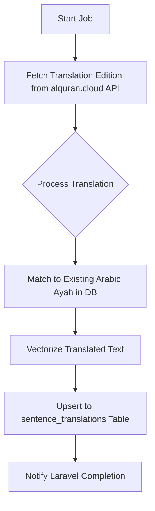

# Pipeline: `quran_translation_flow` — Quran Translations (via API)

**Flow file:** `ai-scripts/flows/quran_translation.py`  
**Trigger level:** Book-level (one trigger → all translations for stored ayahs)  
**Pipeline ID:** `quran_translation_flow`

This pipeline imports **additional translation editions** for Quran ayahs that are *already stored*
in the database by `quran_api_flow`. It does not re-fetch or re-process Arabic text — it only
enriches existing records with new language translations fetched from the alquran.cloud API.

**Example use case:** Arabic + Kemenag (Indonesian) was already imported. Now the admin wants
to add Pickthall (English), Sahih International, or Malay translations.



---

## 1. Filament Setup

| Field | Value | Notes |
|:---|:---|:---|
| **Title** | Quran – Pickthall Translation | Or any edition name |
| **Resource Type** | `quran_translation` | Marks this as a translation-only source |
| **Pipeline ID** | `quran_translation_flow` | Routes to this deployment |
| **Language** | `en` / `ms` / etc. | Target language of this translation |

> [!NOTE]
> This source book is *linked* to the existing Arabic Quran source book via `metadata['parent_book_id']`.
> It does not create new ayah records — it adds new `sentence_translations` rows for existing ayahs.

---

## 2. How It Differs from `quran_api_flow`

| Aspect | `quran_api_flow` | `quran_translation_flow` |
|:---|:---|:---|
| Creates new ayah records | ✅ Yes | ❌ No |
| Fetches Arabic text | ✅ Yes | ❌ No |
| Fetches translation | ✅ Yes (one lang) | ✅ Yes (one or more langs) |
| CAMeL morphology | ✅ Yes | ❌ No (already done) |
| Vectorizes Arabic | ✅ Yes | ❌ No (already done) |
| Vectorizes translation | ✅ Yes | ✅ Yes (new embedding per lang) |
| Writes to | `sentences` (new rows) | `sentence_translations` (new rows) |

---

## 3. AI Processing Flow (Prefect Worker)

| Step | Task | Engine | Action | Output |
|:---|:---|:---|:---|:---|
| 1 | `api_fetchers.get_translation_edition()` | alquran.cloud API | Downloads all ayahs for the requested edition | Array of 6,236 translated verses |
| 2 | Match to existing ayah | PostgreSQL | Looks up existing `sentence.id` by `surah_id + ayah_number` | DB reference |
| 3 | `vectorize.create_embeddings()` | mxbai-embed-large | Embeds the translated text for cross-lingual search | `vector_translation` |
| 4 | Upsert to `sentence_translations` | PostgreSQL | `ON CONFLICT (sentence_id, language) DO UPDATE` | Idempotent save |

---

## 4. Database Write Target

Writes only to `sentence_translations`:

| Column | Value |
|:---|:---|
| `id` | UUID |
| `sentence_id` | FK → matching Arabic ayah in `sentences` |
| `language` | ISO code (e.g., `en`, `ms`) |
| `translation_text` | The translated verse text |
| `embedding` | Dense vector of the translated text |
| `metadata` | `{ "edition": "en.pickthall", "source": "api" }` |

---

## 5. Flow Code Sketch

```python
# flows/quran_translation.py
from prefect import flow, get_run_logger
from tasks import api_fetchers, vectorize
from database import get_book_metadata, match_ayah_by_position, upsert_translation

@flow(name="quran_translation_flow")
def process_quran_translation(book_id: int):
    logger = get_run_logger()
    book = get_book_metadata(book_id)
    edition = book['translation_edition']  # e.g. 'en.pickthall'
    language = book['language']            # e.g. 'en'

    verses = api_fetchers.get_translation_edition(edition)
    logger.info(f"Fetched {len(verses)} translations for edition: {edition}")

    for verse in verses:
        # Find the existing Arabic ayah record
        sentence_id = match_ayah_by_position(verse['surah'], verse['ayah'])
        if not sentence_id:
            logger.warning(f"No ayah found for {verse['surah']}:{verse['ayah']} — skipping")
            continue

        # Embed the translation
        vectors = vectorize.embed_text(verse['text'])

        # Upsert translation row
        upsert_translation(
            sentence_id=sentence_id,
            language=language,
            text=verse['text'],
            embedding=vectors,
            metadata={"edition": edition, "source": "api"},
        )

    _notify_laravel(book_id, "completed")
    logger.info("✅ Translation ingestion complete.")
```

---

## 6. Completion Flow

Same as `quran_api_flow` — Prefect sends a webhook to Laravel, which updates `source_books.status` and fires a Filament notification.
