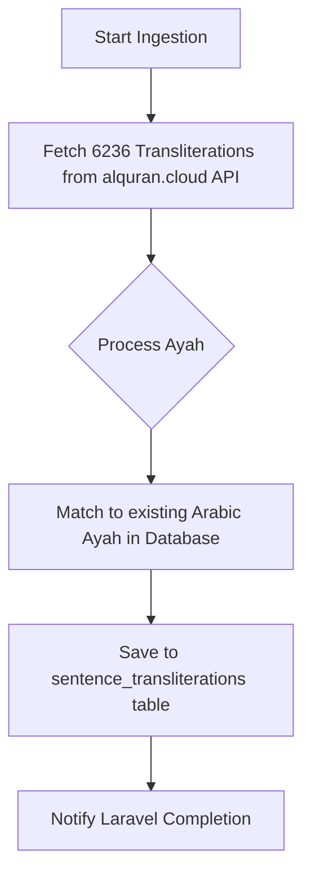

# Pipeline: `quran_transliteration_flow` — Quran Transliteration (via API)

**Flow file:** `ai-scripts/flows/quran_transliteration.py`  
**Trigger level:** Book-level (one trigger → all 6,236 transliterations)  
**Pipeline ID:** `quran_transliteration_flow`

This pipeline is dedicated to importing **certified transliteration editions** (e.g. `en.transliteration`). It ensures 100% accuracy and zero hallucinations by fetching from trusted APIs rather than using LLMs. These are stored against existing Arabic ayahs to enable high-quality Latin-script indexing.

---

## 1. Filament Setup

When an admin creates a Transliteration source book in Filament:

| Field             | Value              | Purpose                           |
| :---------------- | :----------------- | :-------------------------------- |
| **Title**         | Quran Transliteration | Display name                      |
| **Resource Type** | `quran`            | Frontend rendering hint           |
| **Pipeline ID**   | `quran_transliteration_flow` | Routes to this deployment |
| **Language**      | `en`               | Script language                   |
| **Metadata**      | `{"edition": "en.transliteration"}` | Target edition identifier |

---

## 2. Technical Details

### A. Data Source
- **Endpoint**: `https://api.alquran.cloud/v1/quran/en.transliteration`
- **Unit**: Ayah (6,236 records total)

### B. Matching Logic
The flow matches incoming transliterations to existing `sentences` using:
- `surah_id` (stored in `metadata->surah_id`)
- `ayah_number` (stored in `metadata->ayah_number`)

### C. Database Target
- **Table**: `sentence_transliterations`
- **Key Conflict**: `(sentence_id, scheme)` → Update existing if present.

---

## 3. Advantages
| Advantage               | Detail                                                                    |
| :---------------------- | :------------------------------------------------------------------------ |
| **High Accuracy**       | Uses scholarly-vetted transliterations (e.g. Pickthall-aligned).          |
| **Fast Indexing**       | Processes the entire Quran in seconds with zero GPU cost.                 |
| **Reliability**        | Explicit mapping ensures transliterations are perfectly synched to Arabic. |
