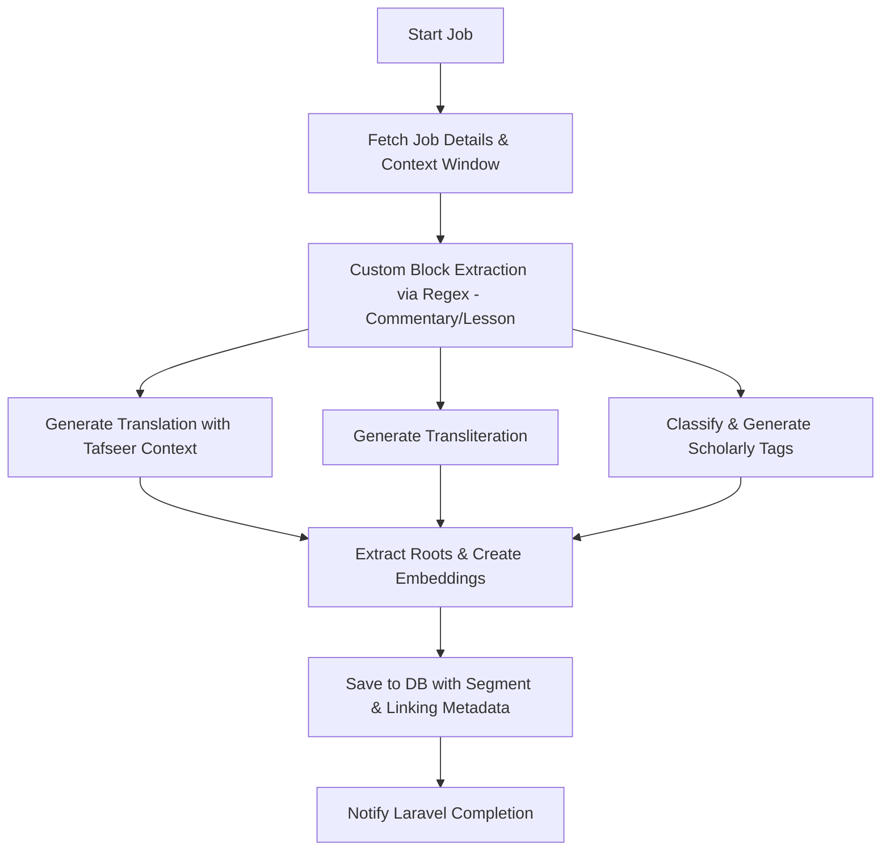

# Pipeline: `tafsir_amal_flow` — Amali Tafseer (Custom TXT)

**Flow file:** `ai-scripts/flows/tafsir_amal.py`  
**Trigger level:** Sentence-level (via `sentence_jobs` queue)  
**Pipeline ID:** `tafsir_amal_flow`

Tafseer Amal (التفسير العملي) uses a highly specific formatting structure that is **not handled correctly**
by the generic `standard_txt_flow`. This dedicated pipeline uses custom regex pre-processing
to correctly segment the text before handing off to the shared task workers.

> [!NOTE]
> The exact regex rules for Amal's formatting are a work-in-progress and will be defined
> as the source `.txt` file is analysed. This file documents the *intended architecture* for the pipeline.



---

## 1. Why a Custom Pipeline?

Standard books use SpaCy's sentencizer to find sentence boundaries. Tafseer Amal has a
structured format where each block follows a pattern like:

```
[آية] قوله تعالى: {ARABIC_QUOTE} [الشرح] {EXPLANATION_TEXT} [الفوائد] {LESSONS...}
```

Feeding this raw into SpaCy produces incorrect splits — the Arabic quote and its commentary
end up as separate sentences, losing the essential link between them. This pipeline uses
**custom regex blockers** to keep quote + commentary together as a single semantic unit.

---

## 2. Filament Setup

| Field | Value | Notes |
|:---|:---|:---|
| **Title** | التفسير العملي | Full book title |
| **Resource Type** | `tafsir` | Renders as tafseer content in UI |
| **Pipeline ID** | `tafsir_amal_flow` | Routes to this Prefect deployment |
| **Language** | `ar` | Source language |
| **Metadata** | `{ "author": "...", "volume": 1 }` | Bibliographical info |

---

## 3. Custom Segmentation Strategy

Instead of SpaCy's sentencizer, this flow uses a regex-based **block extractor**:

| Segment Type | Regex Pattern (Intent) | Output Unit |
|:---|:---|:---|
| Section header | `^\[آية\]` | Metadata-only (skipped as sentence) |
| Quoted ayah | Pattern after `قوله تعالى:` | Attached as metadata to next block |
| Commentary | Text between `[الشرح]` and `[الفوائد]` | Primary sentence unit |
| Lessons block | Text under `[الفوائد]` | Separate sentence per lesson point |

> [!IMPORTANT]
> The final regex patterns will be determined by analysing a real sample of the `.txt` file.
> The structure above is an approximation based on known Tafseer Amal formatting conventions.

---

## 4. AI Processing Flow (Prefect Worker)

| Step | Task | Engine | Action | Output |
|:---|:---|:---|:---|:---|
| 1 | `fetch_job_details()` | PostgreSQL | Loads sentence + context window | Sentence content |
| 2 | Custom block extraction | Regex | Identifies the segment type (commentary, lesson, etc.) | Typed text block |
| 3 | `classify.zero_shot()` | Ollama (Aya) | Full taxonomy classification | Category list (Tafsir-heavy) |
| 4 | `translate.run_ollama()` | Ollama (Aya) | Indonesian translation with Tafseer context | Translated text |
| 5 | `transliterate.run_ollama()` | Ollama (Aya) | ALA-LC romanisation | Transliterated text |
| 6 | `text_prep.extract_roots()` | CAMeL Tools | Morphological root extraction | Lexicon data |
| 7 | `vectorize.create_embeddings()` | mxbai-embed-large | Dense embeddings | `vector_ar`, `vector_id` |
| 8 | `tags.generate_scholarly_tags()` | Ollama (Aya) | Generates Tafseer-specific tags | Tag list |
| 9 | `save_to_db()` | PostgreSQL | Upserts sentence with metadata | Saved record |

---

## 5. Metadata JSONB (per sentence)

| Key | Example | Description |
|:---|:---|:---|
| `category` | `"Tafsir (Exegesis)"` | Primary classification |
| `categories` | `["Tafsir (Exegesis)", "Quranic Sciences"]` | Full list |
| `tags` | `["تفسير", "فقه الآية"]` | Scholarly tags |
| `segment_type` | `"commentary"` / `"lesson"` | Which part of the Amal structure |
| `linked_ayah` | `"2:255"` | If a Quran ayah was quoted in this block |
| `volume` | `1` | Book volume number |

---

## 6. Flow Code Sketch

```python
# flows/tafsir_amal.py
from prefect import flow, get_run_logger
from tasks import classify, translate, transliterate, vectorize, tags, ner
from database import fetch_job_details, save_to_db, save_transliteration
import re, httpx, os

def extract_segment_type(text: str) -> str:
    """Classify this sentence block's role in the Amal structure."""
    if re.search(r'\[الشرح\]', text):
        return "commentary"
    elif re.search(r'\[الفوائد\]', text):
        return "lesson"
    return "general"

def detect_linked_ayah(text: str) -> str | None:
    """Extract surah:ayah reference if an ayah is quoted."""
    # TODO: define regex based on actual file analysis
    return None

@flow(name="tafsir_amal_flow")
def process_tafsir_amal(sentence_job_id: str, lang: str = "id", scheme: str = "ala_lc"):
    logger = get_run_logger()
    job = fetch_job_details(sentence_job_id)
    if not job:
        return

    raw_text = job['content']
    context_prev = "\n".join(job.get('context_prev', []))
    context_next = "\n".join(job.get('context_next', []))

    # Custom metadata
    segment_type = extract_segment_type(raw_text)
    linked_ayah = detect_linked_ayah(raw_text)

    # Standard enrichment tasks
    categories = classify.zero_shot(raw_text, context_prev, context_next)
    translation = translate.run_ollama(
        f"CONTEXT PREV:\n{context_prev}\n\nTARGET (Tafseer Amal):\n{raw_text}\n\nCONTEXT NEXT:\n{context_next}",
        target_lang=lang,
    )
    tl_result = transliterate.run_ollama(raw_text, scheme=scheme)
    vectors = vectorize.create_embeddings(raw_text, translation)
    scholarly_tags = tags.generate_scholarly_tags(raw_text, context_prev, context_next)
    named_entities = ner.extract_entities(raw_text)
    all_tags = list(set(scholarly_tags + named_entities))

    metadata = {
        **(job.get('sentence_metadata') or {}),
        "segment_type": segment_type,
    }
    if linked_ayah:
        metadata["linked_ayah"] = linked_ayah

    save_to_db(
        sentence_id=job['sentence_id'],
        categories=categories,
        translation=translation,
        vectors=vectors,
        needs_emb=job['needs_embedding'],
        needs_trans=job['needs_translation'],
        lang=lang,
        tags=all_tags,
        existing_metadata=metadata,
    )

    if tl_result:
        save_transliteration(job['sentence_id'], tl_result['scheme'], tl_result['transliteration_text'])

    _notify_laravel(sentence_job_id, "completed")
    logger.info(f"✅ Tafsir Amal sentence enriched. Segment: {segment_type}. Alhamdulillah.")
```

---

## 7. Completion Flow

Same as `standard_txt_flow` — Prefect sends a webhook to Laravel, which updates `source_books.status` and fires a Filament admin notification.

---

## 8. Future Work

- [ ] Analyse a sample of the actual Tafseer Amal `.txt` file to define precise regex patterns
- [ ] Map section headers to structured chapters for UI navigation
- [ ] Build the ayah-quotation link logic (`linked_ayah` → cross-reference with Quran Arabic source)
- [ ] Consider volume-aware processing (vol. 1–N as separate `SourceBook` records sharing the same `pipeline_id`)
