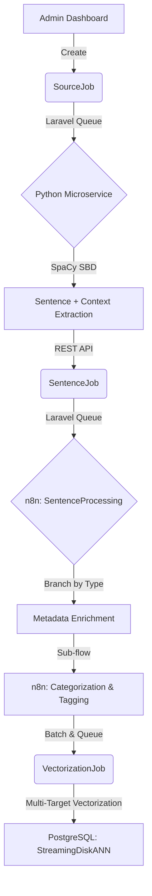

# End-to-End Data Processing & Enrichment Pipeline

This document outlines the architectural flow for transforming raw, unstructured Islamic texts into highly searchable, semantically-enriched data units. The system utilizes a decoupled microservice approach for text segmentation and a LangChain-powered n8n orchestration layer for AI enrichment.

## Stage 1: Source Selection (SourceJob)

1.  **Selection:** An admin selects specific text sources (e.g., volumes, chapters) via the Laravel Filament dashboard.
2.  **Initial Metadata:** Foundational metadata (Source Title, Author, Volume, Resource Type) is securely bound to the `SourceJob`.
3.  **Queueing:** The system pushes the job to a Laravel background queue.
4.  **Trigger:** The queue worker sends the raw text and its preserved metadata to the segmentation engine.

## Stage 2: Segmentation (Python Microservice)

To prevent LLM token waste and memory crashes (OOM), segmentation is handled by a lightweight, dedicated microservice rather than an LLM.

1.  **Microservice Handoff:** Raw text is passed to an isolated Python API.
2.  **Deterministic Splitting (SpaCy):** The microservice utilizes SpaCy's rule-based Sentencizer to instantly split the text into discrete sentences (**Sentence Boundary Detection**). This guarantees zero overlap and naturally eliminates duplicate sentences.
3.  **Context Extraction ("Small-to-Big"):** For every individual sentence identified, the microservice automatically grabs the **5 sentences** immediately preceding and following it. This massive context block is saved alongside the target sentence.
4.  **Ingestion:** The exact sentence, its surrounding context, and original metadata are returned to Laravel via REST API to create `SentenceJob` records.

## Stage 3: Sentence Ingestion (SentenceJob)

1.  **Monitoring:** Newly created `SentenceJob` entries populate the Filament dashboard, allowing admins to monitor ingestion progress.
2.  **Queueing:** These individual tasks are immediately queued for the heavy AI enrichment phase: **SentenceProcessing**.

## Stage 4: AI Processing & Enrichment (n8n Workflow)

The Laravel queue triggers an advanced n8n workflow (`SentenceProcessing`).

### A. Resource Routing
A Switch Node routes the sentence based on its `resource_type` (e.g., Quran, Hadith, Tafsir). The LLM uses resource-specific prompts (e.g., separating Isnad from Matn for Hadith, or extracting Root Words for Language Tools) and saves the output to a dynamic JSON object.

### B. Categorization & Tagging Sub-Flow
The AI analyzes the sentence and its surrounding context to apply structural and searchable metadata.

1.  **Categorization (Hierarchical & Controlled):**
    *   The AI must classify the text into predefined, rigid roots (e.g., Discipline: **Fiqh** -> Chapter: **Muamalah**).
    *   **Auto-widening Rule:** If the AI determines a new Sub-chapter is required, it cannot create it directly. It places the suggestion in a "Waiting Room" array for admin approval.
2.  **Tagging (Flat & Unrestricted):**
    *   The AI acts freely to extract hyper-specific metadata as flat tags (e.g., `[Mu'adz_bin_Jabal]`, `[Zakat]`, `[Yemen]`).

### C. Batching & Multi-Target Vectorization
To optimize API costs and network latency, processed records are not embedded one by one.

1.  **Batching:** Processed `SentenceJobs` are grouped into batches of 50–100 items.
2.  **Multi-Target Vectorization:** The system sends bulk API calls to the embedding model (e.g., OpenAI or Cohere) to vectorize multiple targets per item:
    *   **Text Vector:** The embedding of the core sentence + context.
    *   **Category Vector:** The embedding of the assigned Discipline/Chapter.
    *   **Tag Vectors:** The embeddings of the extracted tags.
    *   *(Note: Vectorizing categories and tags allows the system to perform semantic routing and fuzzy filtering later).*

## Stage 5: Database Storage (PostgreSQL)

The final enriched data is written to a unified PostgreSQL database optimized for high-performance AI retrieval.

1.  **Relational Data:** ID, Resource Type, core sentence, and context strings.
2.  **JSONB Schema:** The dynamic resource metadata, exact Category hierarchy, and Tag arrays are stored in a strictly typed **JSONB** column for fast filtering.
3.  **Vector Indexing:** The generated embeddings are stored using the `pgvector` extension and indexed using **StreamingDiskANN** (via `pgvectorscale`). This ensures the index remains on the SSD, allowing the system to scale to millions of records without exhausting server RAM.

## Data Flow Diagram

---

*For technical implementation details, n8n switch logic, and specific LLM prompts, see [details.md](./details.md).*
