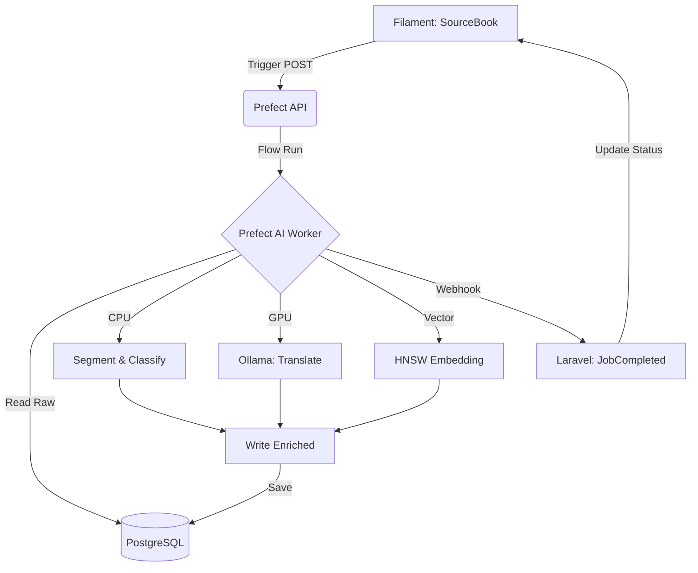

# End-to-End Data Processing & Enrichment Pipeline

This document outlines the architectural flow for transforming raw, unstructured Islamic texts into highly searchable, semantically-enriched data units. The system utilizes a **Prefect-orchestrated AI Pipeline** that handles the entire conversion process, allowing the Laravel application to remain lightweight and focused on orchestration and monitoring.

---

## 🏗️ Core Laravel & Filament Resources

Because Prefect handles the heavy lifting (reading directly from PostgreSQL and writing back to it), Laravel focuses on three primary models and their corresponding Filament resources.

### 1. SourceBook (Text Source)
The entry point for all research data. Admins use this resource to manage primary sources and trigger the AI factory.
- **Database:** `source_books` (id, title, author, resource_type, language, status)
- **Filament Action:** **"Process with AI"**. This custom action sends an HTTP POST to the Prefect API to create a flow run and updates the status to `processing`.

### 2. SentenceJob (Batch Monitoring)
Since ingestion processes thousands of sentences, this is a **Read-Only** monitoring table used to track the progress of the background worker.
- **Database:** `sentence_jobs` (id, source_book_id, raw_text, status)
- **Monitoring:** Integrated Stats Overview Widget showing "Total Pending", "Processed Today", and "Failed Jobs".

### 3. Item / Sentence (Enriched Search Database)
The final, AI-enriched result. This resource allows for manual scholarly review and corrections.
- **Database:** `items` (id, resource_type, text, metadata [JSONB], text_vector [vector])
- **Filament Interface:** Uses a JSON form plugin to allow precise editing of tags, categories, and hierarchical arrays.

### 4. Linguistic Lexicon (Root & Word Explorer)
Resources for exploring the foundational components of the database. Useful for scholars performing deep morphological research.
- **LexiconRootResource:** Allows searching and managing base roots (Jidhr). Shows all associated words and their semantic vector proximity.
- **LexiconWordResource:** Manages surface words (Arabic with/without Harakat). Displays frequency across the corpus and links back to the original `Item` segments.

---

## 🤖 Prefect-Centric Workflow

The AI process is now entirely background-oriented, segmented into a high-performance modular pipeline.

### Stage 1: Trigger (Laravel -> Prefect)
The Admin clicks "Process with AI" in Filament. Laravel notifies Prefect to start the `Islamic Text Ingestion` flow for a specific `source_book_id`.

### Stage 2: Ingestion & Segmentation (Prefect CPU)
The pipeline reads the raw text from the database and uses **SpaCy** and **Regex** to:
1.  Strip Harakat (vowel marks).
2.  Segment text into sentences with preserved context boundaries.

### Stage 3: Deep Enrichment (Prefect GPU x Ollama)
For every segment, the pipeline performs:
1.  **Classification:** Zero-shot categorizing into scholarly branches (Fiqh, Aqidah, etc.).
2.  **Translation:** Generating formal Indonesian translations via the **Aya** model.
3.  **Vectorization:** Generating multilingual embeddings for concept-based search.

### Stage 4: Webhook Completion (Prefect -> Laravel)
When the processing is complete, Prefect calls a Laravel API endpoint to notify the system.
- **Endpoint:** `POST /api/webhooks/prefect/job-completed`
- **Logic:** Updates the `SourceBook` status to `completed` and records the final processed count.

---

## 📈 Data Flow Diagram

---

*For detailed model schemas, Python script logic, UI architecture, and personalization systems, see [pipeline.md](./pipeline.md), [details.md](./details.md), [frontend.md](./frontend.md), [quranic-tadabbur-amal.md](./quranic-tadabbur-amal.md), and [user-personalization.md](./user-personalization.md).*
