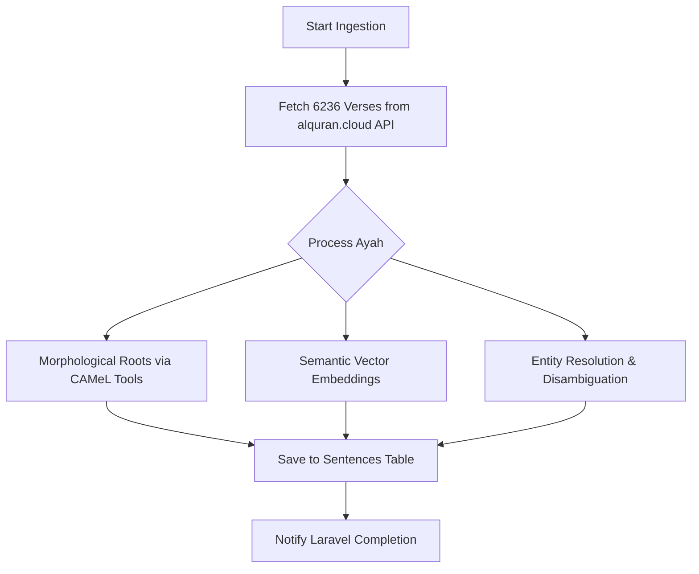

# Pipeline: `quran_api_flow` — Quran Arabic Text

**Flow file:** `ai-scripts/flows/quran_api.py`  
**Trigger level:** Book-level (one trigger → all 6,236 ayahs)  
**Pipeline ID:** `quran_api_flow`

## 🕌 Overview
The Quran requires absolute structural perfection. Instead of relying on AI for sentence boundaries, this pipeline fetches data from the **alquran.cloud** REST API, which provides verse-by-verse JSON with full theological metadata.

> **Theological safety principle:** This flow never uses LLMs for translation. Indonesian translations (e.g., Kemenag) are fetched directly from trusted authorities.

---

## 🏗️ Execution Workflow

### 1. Filament Handshake
Admin creates the Quran source book and clicks **"Start Ingestion"**.
- Payload: `{ book_id: UUID, arabic_edition: "quran-uthmani", translation_edition: "id.indonesian" }`

### 2. AI Processing (Prefect Worker)
The pipeline executes a specialized flow that bypasses standard text segmentation.

| Step | Task | Engine | Action |
| :--- | :--- | :--- | :--- |
| 1 | **Fetcher** | `api_fetchers` | Retrieves Arabic text + Official Translation |
| 2 | **Linguistic** | `text_prep` | CAMeL Tools extraction of 3-letter Roots |
| 3 | **Semantic** | `vectorize` | Generates 1024-d vectors for both languages |
| 4 | **Knowledge** | `entity_res` | Identifies Prophets, Places, and Concepts in the Ayah |
| 5 | **Storage** | `database` | Upserts into `sentences` and `sentence_entity` tables |

---

## 🗄️ Database Mapping

### Sentences Table (`sentences`)
| Column | Value / Logic |
| :--- | :--- |
| `resource_type` | `quran` |
| `sentence_text` | Arabic WITH harakat |
| `metadata->surah_id` | e.g. `2` (Al-Baqarah) |
| `metadata->ayah_num` | e.g. `255` (Ayat al-Kursi) |
| `metadata->page` | Mushaf page for dual-panel rendering |

### Entity Mapping
Quranic entities (e.g. **Musa**, **Fir'aun**, **Makkah**) are automatically linked via the Knowledge Graph.
- **NER**: Fast CPU model flags the entity.
- **Disambiguation**: Ollama verifies identity via Surah context.
- **Linking**: Stored in `sentence_entity` pivot with context snippets.

---

## ✨ Why This Pipeline?
- **Zero Hallucinations**: Canonical translations only.
- **Structural Integrity**: Guaranteed Ayah counts and numbering.
- **Deep Search**: Combined Root-based search + Semantic similarity.
