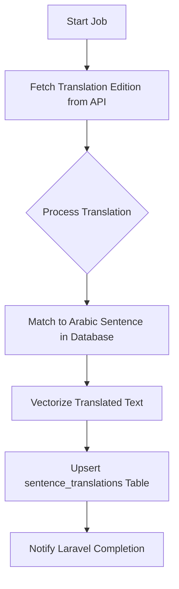

# Pipeline: `quran_translation_flow` — Quran Translations

**Flow file:** `ai-scripts/flows/quran_translation.py`  
**Trigger level:** Book-level  
**Pipeline ID:** `quran_translation_flow`

## 📖 Overview
This pipeline enriches existing Quran ayahs with **additional translation editions** (e.g. Pickthall, Sahih International). It identifies existing Arabic sentences by their Surah/Ayah position and attaches new language layers.

---

## 🏗️ Technical Workflow

### 1. Data Retrieval
Fetches 6,236 verses for the requested edition (e.g. `fr.hamidullah`) from the alquran.cloud API. 

### 2. Multi-Lingual Sync
Each translation is linked to the base Arabic sentence via the `surah_id` and `ayah_number` metadata. This ensures that a search for a concept in French correctly highlights the corresponding Arabic verse.

### 3. Translation Vectorization
Unlike standard keyword search, this pipeline generates **full semantic embeddings** for every translation. This enables users to perform vector search in their native language and find relevant Arabic verses even if the word usage differs slightly.

---

## ⚙️ Configuration
| Attribute | Logic |
| :--- | :--- |
| **Matching Key** | `metadata->surah_id` + `metadata->ayah_num` |
| **Storage** | `sentence_translations` (Polymorphic-style links) |
| **Search Sync** | Automatically triggers Meilisearch update |

---

## ✨ Advantages
- **Infinite Scalability**: Add any language supported by the API without reprocessing the Arabic source.
- **Symmetric Search**: Query in English ➔ Result in Arabic. Query in Arabic ➔ Result in English.
- **Data Integrity**: Uses certified editions, preventing the "drift" inherent in AI-generated translations for sacred texts.
