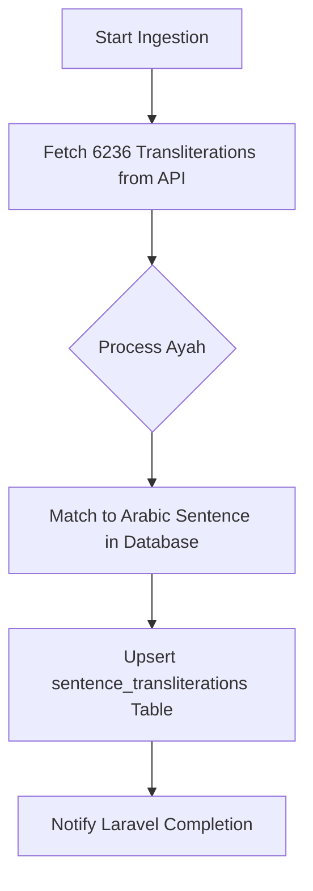

# Pipeline: `quran_transliteration_flow` — Quran Transliteration

**Flow file:** `ai-scripts/flows/quran_transliteration.py`  
**Trigger level:** Book-level  
**Pipeline ID:** `quran_transliteration_flow`

## 📖 Overview
This pipeline imports **certified transliteration editions** (e.g. `en.transliteration`). It ensures 100% accuracy and zero hallucinations by fetching from trusted APIs rather than using LLMs. These are stored against existing Arabic ayahs to enable high-quality Latin-script indexing for users who cannot read Arabic.

---

## 🏗️ Technical Workflow

### 1. Data Retrieval
The worker pings `alquran.cloud` for a full edition. It handles pagination and rate limiting internally to ensure a stable 6,236 record fetch.

### 2. Precise Matching
Transliterations are matched to Arabic `sentences` using specific metadata keys:
- `metadata->surah_id`
- `metadata->ayah_number`

### 3. Database Upsert
- **Target**: `sentence_transliterations` table.
- **Handling**: `ON CONFLICT (sentence_id, scheme) DO UPDATE` ensures existing records are refreshed without duplication.

---

## ⚙️ Configuration
| Key | Example Value |
| :--- | :--- |
| `book_id` | UUID of the Transliteration Book |
| `edition_name` | `en.transliteration` |
| `scheme` | `ALA-LC` (Frontend display hint) |

---

## ✨ Advantages
- **Scholarly Integrity**: Uses vetted transliterations (e.g. DMG or ALA-LC standards).
- **Indexing Perf**: Allows the platform to offer "pseudo-Arabic" search (e.g. typing *bismillah* to find *بِسْمِ اللَّهِ*).
- **Zero Compute Cost**: Pure API-to-DB mapping with no LLM inference needed.
