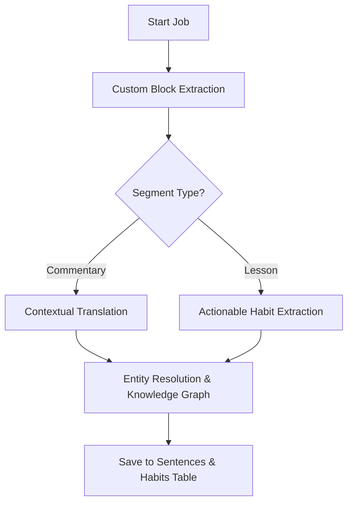

# Pipeline: `tafsir_amal_flow` — Amali Tafseer

**Flow file:** `ai-scripts/flows/tafsir_amal.py`  
**Trigger level:** Sentence-level  
**Pipeline ID:** `tafsir_amal_flow`

## 📖 Overview
Tafseer Amal (التفسير العملي) is a highly structured exegesis that focuses on the practical application of Quranic verses. This pipeline uses **custom regex segmentation** to respect its unique format (Commentary + Lessons) before applying standard AI enrichment.

---

## 🏗️ Technical Workflow

### 1. Structural Segmentation (Beyond SpaCy)
Unlike standard prose, Tafseer Amal follows a block pattern:
- `[الشرح]` (Commentary): The linguistic and contextual explanation.
- `[الفوائد]` (Lessons/Habits): Direct practical applications.
The pipeline uses custom regex to keep these tied to their parent Quranic quote, preventing the "context loss" common in generic sentencizers.

### 2. Entity Disambiguation (Grammar & History)
- **Concept Mapping**: Terms like *Zuhd*, *Ikhlas*, or *Tazkiyah* are resolved into canonical Entities.
- **Biographical Linking**: Mentions of Sahaba or classical scholars cited in the commentary are linked to their respective Knowledge Graph nodes.

### 3. Actionable Habit Extraction
For segments typed as `lesson`, the LLM is prompted to extract **Actionable Habits**.
- **Result**: Data is shared with the `user_habits` system, allowing users to "Track this habit" directly from the Reading Mode tooltip.

---

## ⚙️ Configuration
| Key | Logic |
| :--- | :--- |
| **Segment Types** | `commentary`, `lesson`, `quote` |
| **LLM Context** | Injected with "Scholarly Reflection" system prompt |
| **Vector Strategy** | High weight on lesson blocks for "Action Search" intent |

---

## ✨ Advantages
- **Structured Contemplation**: Maintains the original book's intent by distinguishing between theory and practice.
- **Knowledge-to-Action**: The Knowledge Graph maps abstract concepts (e.g. *Sabr*) directly to practical lessons extracted from this text.
- **Cross-Referencing**: Automatic linking to the `quran` resource type via detected ayah quotes.
