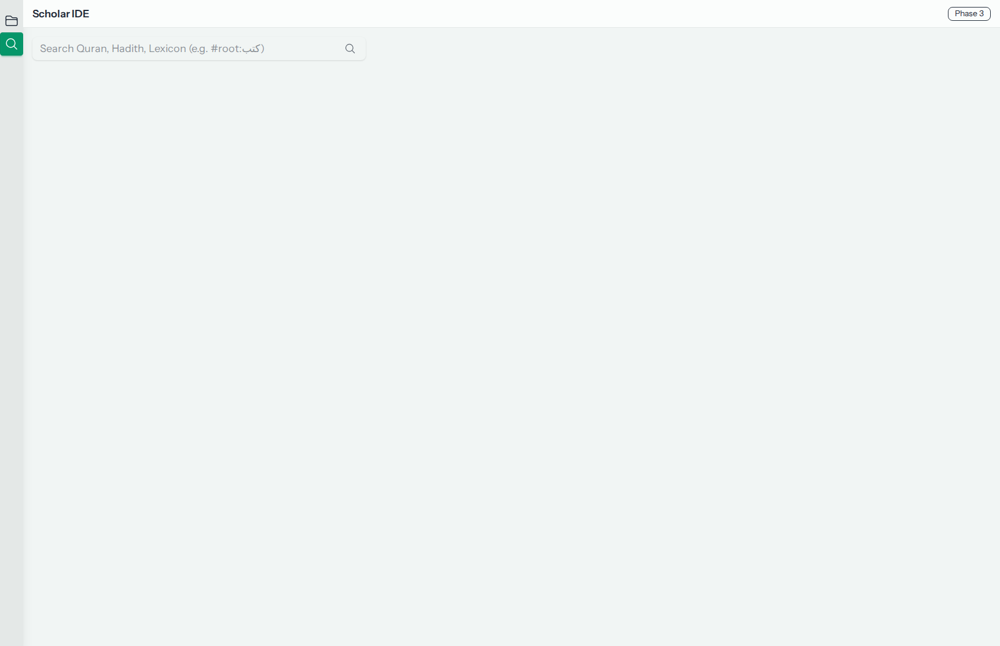
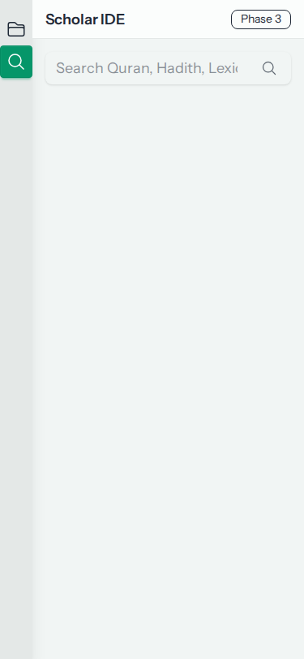
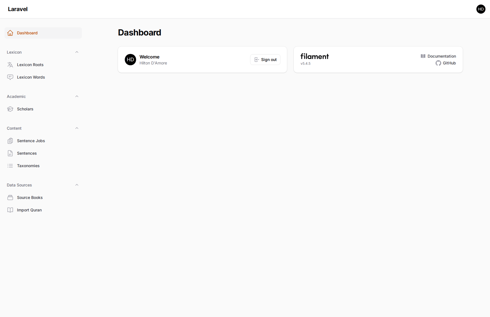

# 🎨 IslamResearch UX Showcase

This document provides a visual overview of the platform's current UI/UX state, as captured by our automated browser testing suite.

---

## 🔬 Scholar IDE (Frontend)

The Scholar IDE is built with **Livewire 4** and **Tailwind v4**, featuring a reactive workspace for deep research.

### 🖥️ Desktop View

---

### 📱 Mobile View
Captured at 375x812 resolution to verify responsive adaptation.

---

## ⚙️ Admin Panel (Filament)

The backend management layer powered by **Filament V5**.

### 📊 Dashboard

---

> [!TIP]
> These screenshots are automatically updated whenever `vendor/bin/sail artisan test tests/Browser/SmokeTest.php` is executed.
